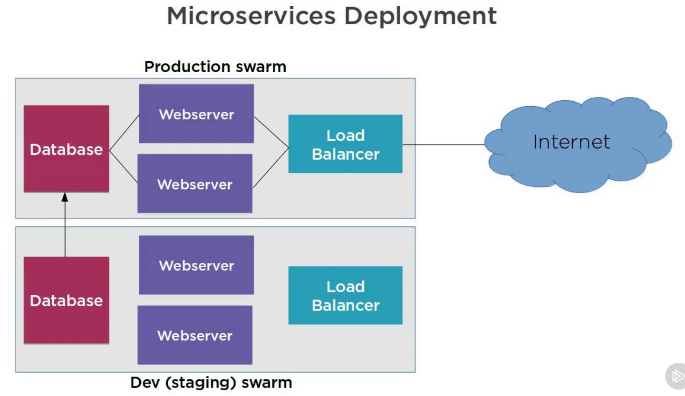
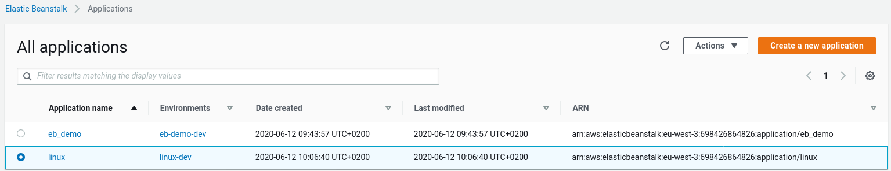

# Linux

# Exercices utilisation de docker avec AWS Elastic Beanstalk

AWS Elastic Beanstalk est un service facile à utiliser pour déployer et faire évoluer des applications et services Web développés avec Java, .NET, PHP, Node.js, Python, Ruby, Go et Docker sur des serveurs familiers tels qu'Apache, Nginx, Passenger et IIS.

Vous pouvez simplement télécharger votre code et Elastic Beanstalk gère automatiquement le déploiement, du provisionnement de capacité, de l'équilibrage de charge, de la mise à l'échelle automatique à la surveillance de l'intégrité des applications. Dans le même temps, vous conservez un contrôle total sur les ressources AWS alimentant votre application et pouvez accéder à tout moment aux ressources sous-jacentes.

Nous allons utiliser les container docker avec AWS EB.


## Introduction

* Allez a la racine de votre projet
* Creer un fichier index.html
* Creer un fichier DockerFile

```Dockerfile
FROM ubuntu:latest
MAINTAINER D Clinton info@bootstrap-it.com
ARG DEBIAN_FRONTEND=noninteractive
RUN apt-get update
RUN apt-get install -y apache2
ADD index.html /var/www/html/
CMD /usr/sbin/apache2ctl -D FOREGROUND
EXPOSE 80
```

* Monter l'image ubuntu dans votre docker, si celle-ci n'est pas deja montée.

```cmd
docker pull ubuntu
```

* Constructure l'image myserver docker

```cmd
sudo docker build -t myserver .
```

* Executer myserver sur le daemon docker

```cmd
sudo docker run -d myserver
```

* Verification docker

```cmd
sudo docker ps -a
sudo docker network ls
sudo docker network inspect bridge
```

**reperer IPv4Address pour etape suivante**

* Execution de ligne de commande cUrl

cURL (abréviation de client URL request library : « bibliothèque de requêtes aux URL pour les clients » ou see URL : « voir URL ») est une interface en ligne de commande, destinée à récupérer le contenu d'une ressource accessible par un réseau informatique. 

```cmd
sudo curl [IPv4Address]
```

**Votre page html s'affiche**

## Initialisation de swarm manager

Docker Swarm fournit une fonctionnalité de clustering native pour les conteneurs Docker, qui transforme un groupe de moteurs Docker en un seul moteur Docker virtuel


```cmd
sudo docker swarm init
```

#### Swarm

* Pour connaitre les nodes sur ce swarm

```cmd
sudo docker node ls
```
```cmd
sudo docker info
```
#### Executer un service (exemple de nginx)

* Execution du service nginx

```cmd
sudo docker service create -p 80:80 --name webserver nginx
```

* Controle du service sur docker

```cmd
sudo docker service ls
```

* Voir les informations du container

```cmd
sudo docker service ps webserver
```

#### Dimensionner (scale) le swarm

Exemple de 5 containers répartie sur nos machines

* Repartie sur 5 nodes l'images nginx

```cmd
sudo docker service scale webserver=5
```

* Controle

```cmd
sudo docker service ps webserver
sudo docker network ls
//exemple avec docker_gwbridge
sudo docker network inspect docker_gwbridge
// relever [IPv4Address]
sudo curl [IPv4Address]
```



*Attention* a partir de la vous avez 5 services docker en fonctionnement pensez à les stopper:


* Supprimer Swarm et les services exposés (aubesoin bien sure)

```cmd
sudo docker service rm $(docker service ls -q)
sudo docker stop $(docker ps -a -q)
sudo docker ps -a
sudo docker stop $(docker ps -a -q)
sudo docker swarm leave -f
sudo docker stop [ID_CONTAINER]
```

## Installation de Elastic Beanstalk CLI

* Creer un compte sur aws
* Cliquer sur Elastic Beanstalk
* Cliquer sur Mon profil > My Security Credentials
* Cliquer sur Access keys > Create New Access Key 
* Cliquer sur Show Access Key et retene en memoire vos clés (attention de ne pas les diffuser dans un repository git ou autre)

### Installation de Elastic Beanstalk CLI avec pip

* Dans le terminal installer pip.py

```cmd
sudo apt update
sudo apt-get install python3-dev
curl -O https://bootstrap.pypa.io/get-pip.py
sudo python3 get-pip.py --user
/////////////////////////////////////////////////////////////////////////////////
//IMPORTANT le PATH /root/.local/bin est indiqué lors de l'execution precedente//
/////////////////////////////////////////////////////////////////////////////////
export PATH=$PATH:/root/.local/bin


```
* Verification de python3 version

```cmd
sudo python3 --version
```

* Verification de pip version

```cmd
sudo pip --version
```

* Installation du client aws Elastic Beanstalk

```cmd
sudo pip install awsebcli --upgrade --user
```

* Configurer votre path

```cmd
which eb
```
**recuperer le chemin**

```cmd
export PATH=$PATH:$HOME/.local/bin
```
* Verification de eb version

```cmd
sudo eb --version
```

* Desinstaller eb avec pip

```cmd
sudo pip uninstall awsebcli
```

### Installation de Elastic Beanstalk CLI version 2. Homebrew bcp mieux

**https://docs.aws.amazon.com/elasticbeanstalk/latest/dg/eb-cli3-install-osx.html**

```cmd
brew update
brew install awsebcli
eb --version
```

## Elastic Beanstalk toolset

**Etre patient lors de l'execution des command eb cela peux prendre quelques instants pour la creation devos environnement**

* Command line eb

```cmd
sudo eb
```

* Prerequis

Avoir un fichier dockerFile (pour notre exemple)

* A partir de la racine de l'application initialiser eb

```cmd
eb init
```

* Indiquer votre region
* Indiquer vos clés AWS 
* Indiquer le nom de votre application
* Indiquer la plateform (ici docker)
* Indiquer la branch de la plateform
* Indiquer Yes pour avoir une cle SSH (puis tapper 2-3 fois sur entrer)

* Retourne la liste des eb

```cmd
eb list
```
* Creation d'un environnement eb

```cmd
eb create
```
* Suppression d'un environnement eb

```cmd
eb terminate [myapp] --all
```

**La suppression comme pour la creation peux prendre un certain temps**

* Besoin de modifier les propriete du projet eb ?

```cmd
eb init -i
```

### Docker sur Elastic Beanstalk

* Indique la plateforme eb utilisé

```cmd
eb platform show
```



### Preconfiguration

1 . Maintenant que aws ebcli est operationnelle nous allons tous arreter (stop eb dans aws ou en ligne de command bien check que eb list soit vide) pour modifier un fichier DockerFile preconfigure

*ATTENTION* certaine instance elastic beanstalk ou EC2 reste visible dans la console AWS avec le status terminated, cela prend un moment avant leur suppression total.

Avant:

```Dockerfile
FROM ubuntu:latest
MAINTAINER D Clinton info@bootstrap-it.com
ARG DEBIAN_FRONTEND=noninteractive
RUN apt-get update
RUN apt-get install -y apache2
ADD index.html /var/www/html/
CMD /usr/sbin/apache2ctl -D FOREGROUND
EXPOSE 80
```

Apres:

```Dockerfile
# Utilisation de l'image AWS Elastic Beanstalk Python 3.4
FROM amazon/aws-eb-python:3.4.2-onbuild-3.5.1
# Exposes port 8080
EXPOSE 8080
# Installation de dependances PostgreSQL
RUN apt-get update && \
    apt-get install -y postgresql libpq-dev && \
    rm -rf /var/lib/apt/lists/*
```

2 . Puis creer une instance de aws eb cli

```cmd
eb create testenv
```

Apres avoir cree votre environnement elastic beanstalk vous pouvez constater dans votre console AWS qu'une machine EC2 est alors instancié


3 . Cliquer sur Runnig instance

Nous pouvons observer dans l'onglet Description de notre instance EC2:

* De quelle groupe de securite nous faisons partie
* l'Id AMI (Amazon Machine Image) avec son contenu.
* Les données de connexion Public DNS (IPv4) et IPv4 Public IP

**Stoper tous avant de passer à la prochaine étape**

Rappel pour tous stopper

* Destruction du client eb (eb list) et docker

```cmd
sudo eb terminate [nom app] --all
sudo docker ps
sudo docker stop [ID_CONTAINER]
sudo docker swarm leave -f
// Pour retirer le bridge
sudo ip link del docker0
sudo systemctl stop docker
```


## Dockerrun.aws.json version


# apt

* Permet de mettre à jours les packages installé

```cmd
apt-get update
```
* Permet de mettre à jours à la dernière version des packages installé

```cmd
apt-get update
```

Pour visualiser la liste des paquets installés

```cmd
dpkg-query -W
```


# homebrew

Pour avoir de l'aide sur les lignes de commmandes brew

```cmd
brew help
brew commands
```
Pour visualiser la liste des paquets installés

```cmd
brew list
```

# npm

```cmd
curl -sL https://deb.nodesource.com/setup_10.x | sudo -E bash -
sudo apt install -y nodejs
```

Installer le global localement

Quand vous installez des paquets via npm, si vous ne précisez rien, ils seront installés dans le dossier actuel, généralement du projet en cours. Certains paquets, notamment les outils doivent s’installer globalement avec l’option -g. Pour éviter que ceux-ci s’installent dans un dossier système et exigent l’accès root, vous pouvez:

* créer un dossier dédié

```cmd
mkdir ~/.npm-global
```

* Configurer npm pour utiliser ce dossier

```cmd
npm config set prefix '~/.npm-global'
```

* Ajouter cette ligne à votre fichier .profile ou .bashrc

```cmd
export PATH=~/.npm-global/bin:$PATH

```

* Mettre à jour les variables

```cmd
source ~/.profile
```

* Installation de npm en privilege root

```cmd
sudo npm install
```
# netstat
https://www.rekha.com/netstat-cheat-sheet-for-newbies.html

# Bug-fix et tricks

1. Comment passer d'un user a un autre dans une console ?

Return current user

```cmd
whoami
```

change le current user (en invite1)

```cmd
su - invite1
```

2. Ecouter les ports (80)

```cmd
sudo fuser 80/tcp
```

3. Kill un processus (port 80)

```cmd
sudo lsof -t -i tcp:80 -s tcp:listen | sudo xargs kill
```

4. ERROR Linuxlite: la session s'ouvre mais ne s'ouvre pas

* Supprimer le fichier XAuthority (remplacer [user] par le votre)

```cmd
sudo rm -f /home/[user]/.Xauthority
```

* Creer le fichier XAuthority (remplacer [user] par le votre)

```cmd
touch /home/[user]/.Xauthority
```

5. Update à la derniere version d'une image

```cmd
docker pull [image]:latest
```

6. Connaitre la location du script de notre shell et ajouter/ modifier les variables d'environnements

```cmd
echo $SHELL
ls -a ~
printenv
```

Si presence de:

* Bash alors modifier script .bash_profile, .profile ou .bash_login. 
* Zsh alors modifier script .zshrc
* Tcsh alors modifier script .tcshrc, .cshrc ou .login. 

https://www.tremplin-numerique.org/comment-definir-des-variables-denvironnement-dans-bash-sous-linux


7. Editer un fichier de n'importe ou

```cmd
nano ~/.bash_profile 
```

8. Comment stopper Docker et recuperer internet lorsque la connexion est sur docker bridge

* Faire une restauration syteme dans le pire des cas

* Consulter la connexion

```cmd
ip addr show docker0
```

* Stoper la connexion docker0

```cmd
ip link del docker0
```

* reload du daemon docker

```cmd
systemctl daemon-reload
```

9. Homebrew

* Copier/coller dans votre terminal

```cmd
/bin/bash -c "$(curl -fsSL https://raw.githubusercontent.com/Homebrew/install/master/install.sh
)"
```

* Install the Homebrew dependencies if you have sudo access

```cmd
sudo apt-get install build-essential
```

* Configure Homebrew in your /home/linuxlite/.profile by running

```cmd
echo 'eval $(/home/linuxbrew/.linuxbrew/bin/brew shellenv)' >> /home/linuxlite/.profile
```

* Add Homebrew to your PATH

```cmd
eval $(/home/linuxbrew/.linuxbrew/bin/brew shellenv)
```

* We recommend that you install GCC by running:

```cmd
brew install gcc
```

# Resources

https://www.ionos.fr/digitalguide/serveur/know-how/docker-orchestration-avec-swarm-et-compose/

https://docs.aws.amazon.com/fr_fr/elasticbeanstalk/latest/dg/eb-cli3-install-linux.html

https://buzut.net/maitriser-les-variables-d-environnement/

https://www.tremplin-numerique.org/comment-definir-des-variables-denvironnement-dans-bash-sous-linux